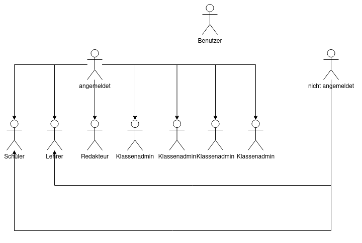
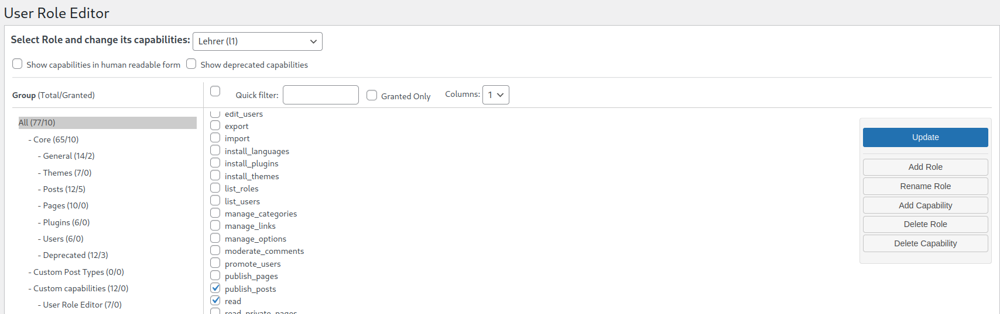
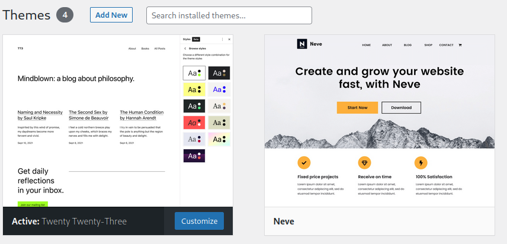
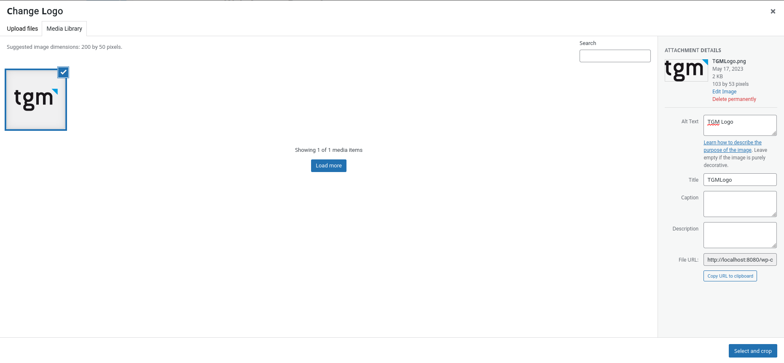
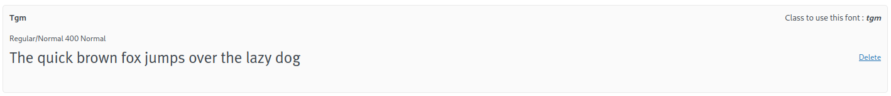
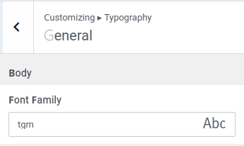
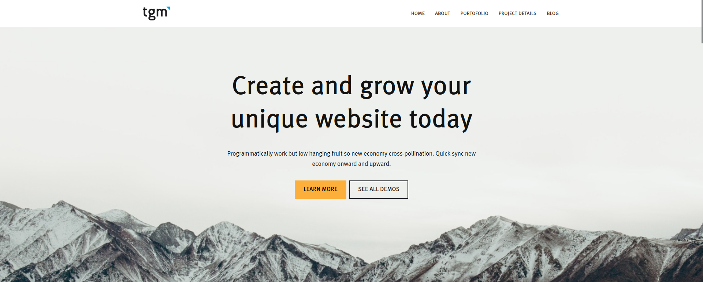

# Protokoll zu "Content Management Systeme"

Andreas Sünder (zusammen mit Benjamin Kissinger)

## Aufsetzen

Die Wordpress Seite wurde für diese Aufgabe mittels Docker-Containern gehostet. Dafür wurde folgendes `compose`-File verwendet:

```docker
services:
  database:
    image: mysql:5.7
    environment:
      MYSQL_ROOT_PASSWORD: root
      MYSQL_DATABASE: symfony
      MYSQL_USER: symfony
      MYSQL_PASSWORD: symfony
    volumes:
      - ./db_wp/data:/var/lib/mysql
    ports:
      - "3306:3306"

  wordpress:
    image: wordpress:latest
    depends_on:
      - database
    ports:
      - "8080:80"
    volumes:
      - ./wp:/var/www/html
    environment:
      WORDPRESS_DB_HOST: database:3306
      WORDPRESS_DB_USER: symfony
      WORDPRESS_DB_PASSWORD: symfony
      WORDPRESS_DB_NAME: symfony
```

## Benutzer & Hierarchie



Die obigen Benutzerrollen können mit dem Plugin `User Role Editor` erstellt werden:



## Themeauswahl

Für diese Aufgabe wurde als Theme `Neve` ausgewählt. Dieses kann  über `Appearance > Themes` installiert und aktiviert werden:



Über `Appearance > Customize` lässt sich das installierte Theme anpassen:



Um die Schriftart ändern zu können, muss das Plugin `Use Any Font` installiert werden. Dort lässt sich die entsprechende `.ttf`-Datei hochladen und als Font speichern.



Zurück im Theme-Customizer lässt sich diese Schriftart dann auswählen.



