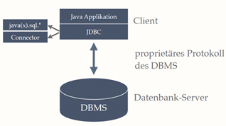

# Aufgabenstellung 01

## Einführung

Die Java Database Connectivity (JDBC) ist eine Java API, die verwendet wird, um sich zu einer Datenbank zu verbinden und gewöhnliche SQL-Queries auszuführen.



Der sogenannte „MySQL Connector/J“, der dafür erforderlich ist, lässt sich via der Oracle-Seite herunterladen: [JDBC Downloads](https://www.oracle.com/database/technologies/appdev/jdbc-downloads.html). Andernfalls kann man die gesamte sql-Bibliothek in Java nicht verwenden.

In IntelliJ lässt sich die heruntergeladene Bibliothek als .jar-Datei einbinden. Möchte man sich mit einer Datenbank verbinden, so ist dem Connection-String die Bezeichnung jdbc: anzuhängen, etwa:

```
jdbc:mysql://localhost:3306/test
```

## Der Cursor

Ein großer Unterschied zum Arbeiten mit SQL-Queries ist, dass die JDBC einen sogenannten Cursor für die Abfragen verwendet. Der gesamte abgefragte Datensatz wird zwar in einem `ResultSet`-Objekt gespeichert, jedoch wird darauf mittels eines Satzzeigers zugegriffen (ähnlich wie bei den Dateistreams). Etwa lässt sich mittels `next()` zum nächsten Datensatz weiterschalten:

```java
while(resultSet.next()) {
    System.out.println(resultSet.getString("..."));
}
```

## Datentypen

Da SQL und Java teils ähnliche Datentypen besitzen, können die meisten primitiven Datentypen wie Zahlen oder Character einfach umgewandelt werden. Für andere Datentypen, die es in Java per se nicht gibt, wurden eigene Wrapper-Klassen definiert.

## Nullwerte

JDBC liefert bei allen `getXXX()`-Methoden (außer `getObject()`) bestimmte Defaultwerte statt `NULL` zurück (bei Zahlen wäre das einfach 0). Mit `wasNull()` lässt sich der zuletzt geholte Wert auf `NULL` überprüfen.
