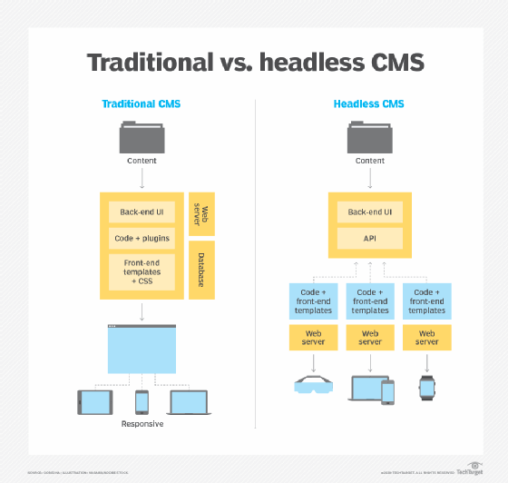
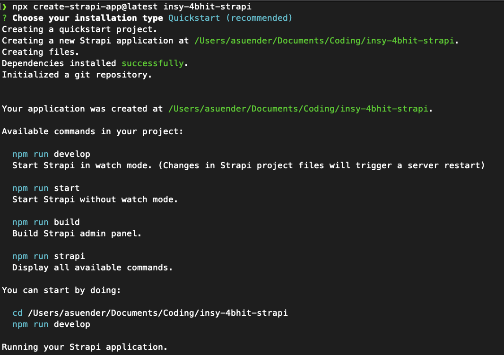
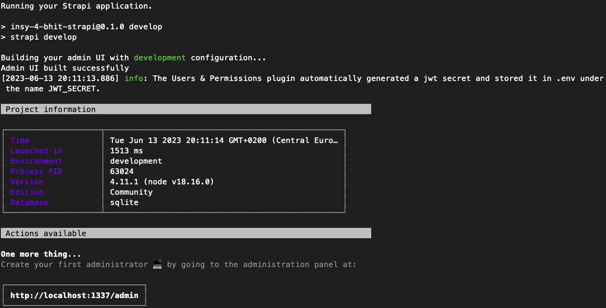
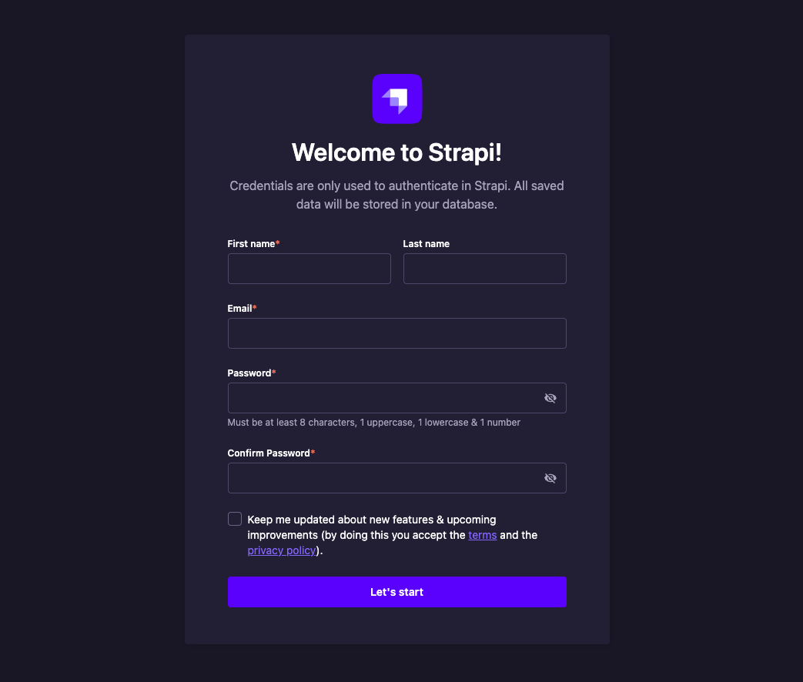
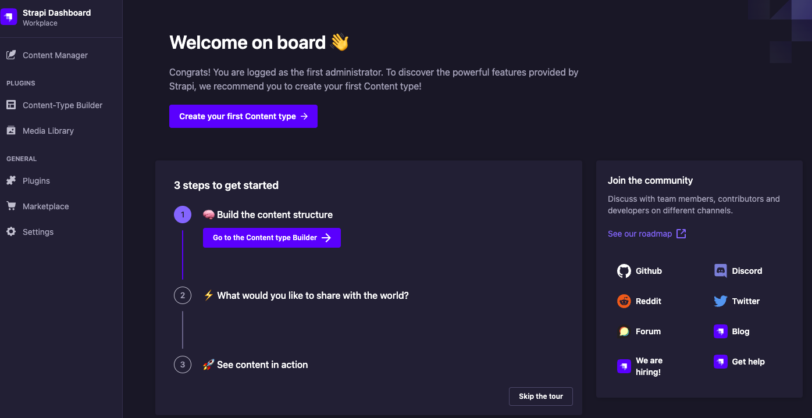
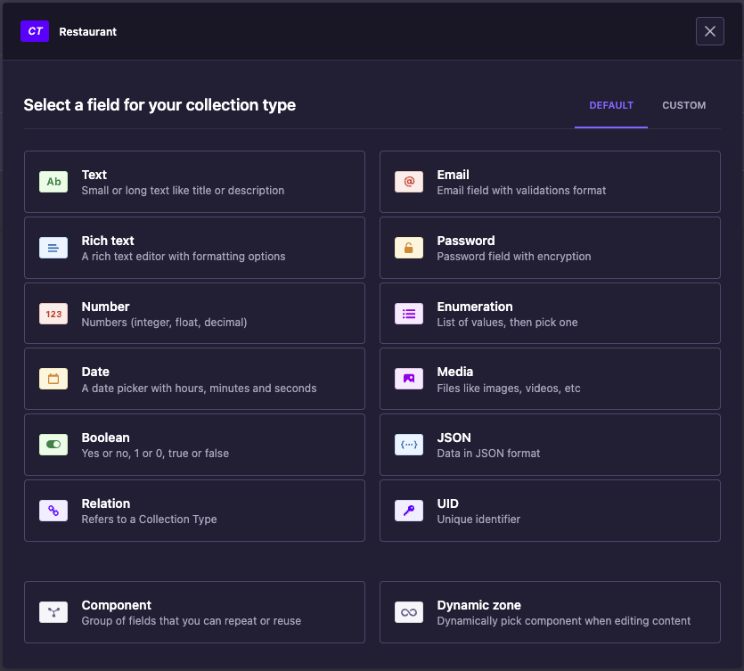
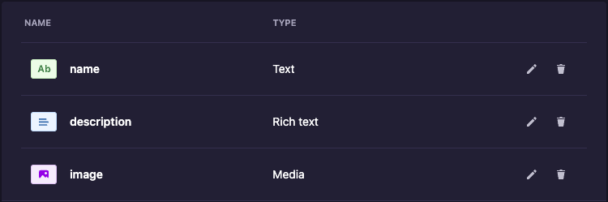
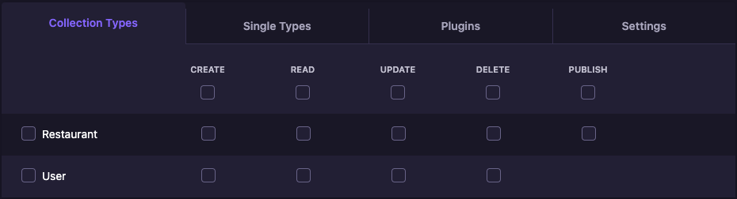
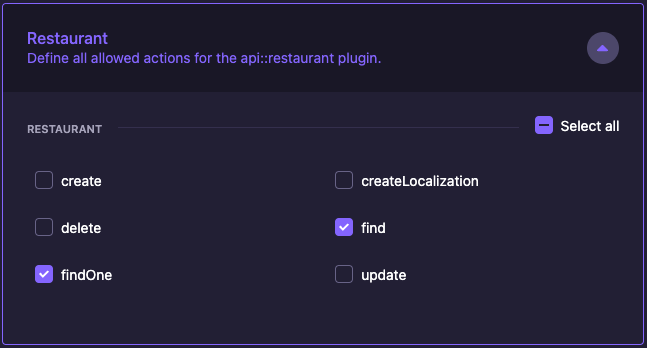

# INSY EK-Modul "Headless CMS - Strapi"

Andreas Sünder 4BHIT - 13.06.2023

## Einführung

Strapi ist es sogenanntes "Headless"-CMS. Das bedeutet, dass es nur die Daten bereitstellt, die dann von einer anderen Anwendung (z.B. einer Website, einer App etc.) abgerufen werden können - es verwaltet daher nur den Content, der im Hintergrund liegt. Am besten lässt sich dies anhand einer Grafik erklären:



Klassische CMS wie Wordpress oder Joomla sind "monolithisch", d.h., sie verwalten sowohl die Daten als auch die Präsentation (also das Frontend). Bei einem Headless-CMS wie Strapi (wobei das "Head" für das Frontend steht) wird das Frontend von einer anderen Anwendung übernommen, die dann die Daten etwa über eine API abruft.

## Aufsetzen von Strapi

Nachdem Strapi auf NodeJS basiert, lässt Strapi über `npm` in einem eigenen "Project" (welches einen einfachen Ordner darstellt) installiert:

```bash
npx create-strapi-app@latest insy-4bhit-strapi
```





Nach dem ersten Einrichten und fertigen Installieren von Strapi lässt sich das Admin-Panel über `http://localhost:1337/admin` aufrufen:



Strapi verwendet das Konzept eines Super-Admins und mehrerer ("Unter-")Admins. Der Super-Admin ist der erste Benutzer, der sich registriert und kann daraufhin weitere Benutzer (die selbst auch Admins sein können) erstellen.

Ist alles eingerichtet, wird man vom Dashboard begrüßt:



## Erstellen einer Collection

Für diese Aufgabe wurde eine Collection mit dem Namen `Restaurant` erstellt, um dort einzelne Restaurants o. Ä. speichern zu können. Dort lassen sich auch benutzerdefinierte Felder erstellen, die dann in der Datenbank gespeichert werden:





## Benutzer und Rollen

Für Strapi gibt es ein Plugin namens `Roles & Permissions`, welches standardmäßig aktiviert ist und es ermöglicht, über die `Settings`-Seite Rollen und Benutzer hinzuzufügen. Für die einzelnen Rollen lässt sich auch einstellen, welche Collections diese Rollen bearbeiten dürfen:



## `Restaurant`-Collection publik setzen

Standardmäßig sind alle neu erstellen Collections `private`, sprich, sie können von außen ohne Anmeldung nicht angesehen bzw. bearbeitet werden. Dies kann man ebenfalls in den Rollen einstellen:



## Aufrufen der Daten über die API

Für jede Collection wird ein eigener Endpoint zur Verfügung gestellt (z.B. über `/api/:pluralApiId`). Bei der Collection `Restaurant` ist das `/api/restaurants`. Die Daten werden dann als JSON zurückgegeben:

```json
{
   "data":[
      {
         "id":1,
         "attributes":{
            "name": "Kent Restaurant",
            "description": "Ein luxuriöses türkisches Restaurant direkt neben dem TGM!",
            "createdAt": "2023-06-13T18:33:41.518Z",
            "updatedAt": "2023-06-13T18:38:19.196Z",
            "publishedAt": "2023-06-13T18:38:19.193Z",
            "locale": "de"
         }
      },
      {
         "id":2,
         "attributes":{
            "name": "Kurze Pause",
            "description": "Ein kleiner Kebap-Stand direkt am Friedrich-Engels-Platz!",
            "createdAt": "2023-06-13T18:40:41.073Z",
            "updatedAt": "2023-06-13T18:40:41.929Z",
            "publishedAt": "2023-06-13T18:40:41.926Z",
            "locale": "de"
         }
      }
   ],
   "meta": { ... }
}
```
