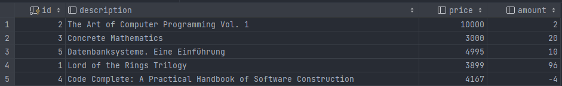

# Dokumentation zum Modul "Transaktionen"

Andreas Sünder

## Generieren einer id fuer neue Bestellungen

Um das Problem mit dem Generieren einer id fuer neue Bestellungen zu loesen, muss die Tabelle mittels SQL gesperrt werden:

```java
conn.setAutoCommit(false);
conn.createStatement().executeUpdate("LOCK TABLE orders IN ACCESS EXCLUSIVE MODE");
```

## Gleichzeitiges Abschicken zweier Bestellungen

Folgendes Python-Skript wird dafür verwendet:

```python
import requests
import concurrent.futures

URLs = [
    "http://127.0.0.1:8000/stats", "http://127.0.0.1:8000/articles",
    "http://127.0.0.1:8000/orders", "http://127.0.0.1:8000/clients",
    "http://127.0.0.1:8000/placeOrder?client_id=1&article_id_1=4&amount_1=12"
    ]

def make_request(url):
    print("Performing request to {}".format(url))
    response = requests.get(url)
    return response.text

def main():
    with concurrent.futures.ThreadPoolExecutor(max_workers=10) as executor:
        futures = [executor.submit(make_request, URLs[4]) for _ in range(2)]
        responses = [future.result() for future in concurrent.futures.as_completed(futures)]
        print(responses)

if __name__ == "__main__":
    main()
```

Wenn dieses ausgeführt wird, dann rutscht die Anzahl der verfügbaren Artikel von Artikel 4 ins Negative:



## Anzeige von Statistiken

Wenn eine Bestellung abgeschickt wird, während die Statistiken angezeigt werden, dann wird die Anzahl der Bestellungen nicht ordentlich aktualisiert.

Dafür wurde das Isolation-Level auf SERIALIZABLE gesetzt:

```java
conn.setTransactionIsolation(Connection.TRANSACTION_SERIALIZABLE);
```

